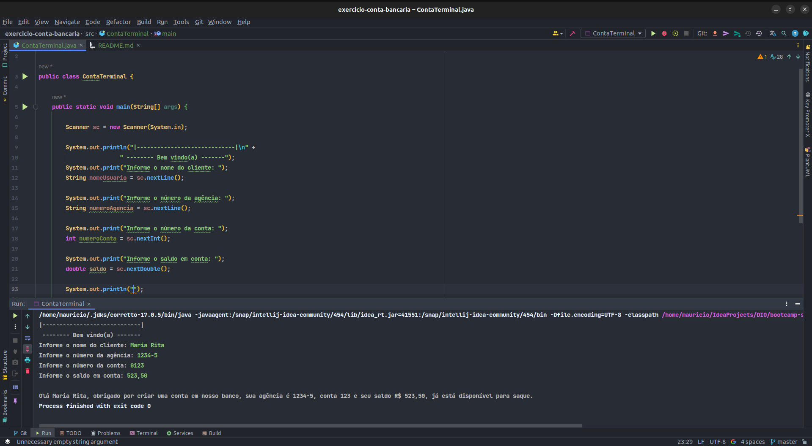

# DIO - Trilha Java Básico
www.dio.me

#### Autores
- [Gleyson Sampaio](https://github.com/glysns)

## Sintaxe - Desafio

Vamos exercitar todo o conteúdo apresentado no módulo de Sintaxe codificando o seguinte cenário.

1. Crie o projeto `ContaBanco` que receberá dados via terminal contendo as características de conta em banco conforme atributos abaixo:
2. Dentro do projeto, crie a classe `ContaTerminal.java` para realizar toda a codificação do nosso programa.

###### Revise sobre regras de declaração de variáveis

| Atributo  | Tipo     | Exemplo   
| --------- | ---------| ------- 
| Numero    | Inteiro  | 1021 
| Agencia   | Texto    | 067-8
| Nome Cliente | Texto    | MARIO ANDRADE
| Saldo | Decimal |237.48

###### Revise sobre terminal, main args e a classe Scanner
2. Permita que os dados sejam inseridos via terminal sendo que o usuário receberá a mensagem de qual informação será solicitada, exemplo:

* Programa: "Por favor, digite o número da Agência !"
* Usuário: 1021 *(depois ENTER para o próximo campo)*

###### Revise sobre concatenação e classe String com método concat

3. Depois de todas as informações terem sido inseridas, o sistema deverá exibir a seguinte mensagem:

*"Olá [Nome Cliente], obrigado por criar uma conta em nosso banco, sua agência é [Agencia], conta [Numero] e seu saldo [Saldo] já está disponível para saque".*

|----------------------------------------------------------------------------------------------------------------------|

Assim como o exercício solicita.

Seguindo as boas práticas de nomeação de Classe e Variável, com nomes bem definidos e alto descritivos.

Usando também o tipo de dado correto atrelado a cada variável.

Ao fim da interação com o usuário, o programa retornará uma mensagem com todos dados informados.

Terminal:

|-----------------------------|

-------- Bem vindo(a) ------- 

Informe o nome do cliente: `Maria Rita`

Informe o número da agência: `1234-5`

Informe o número da conta: `0123`

Informe o saldo em conta: `523,50`

Olá **Maria Rita**, obrigado por criar uma conta em nosso banco, sua agência é **1234-5**, conta **123** e seu saldo R$
**523,50**, já está disponível para saque.